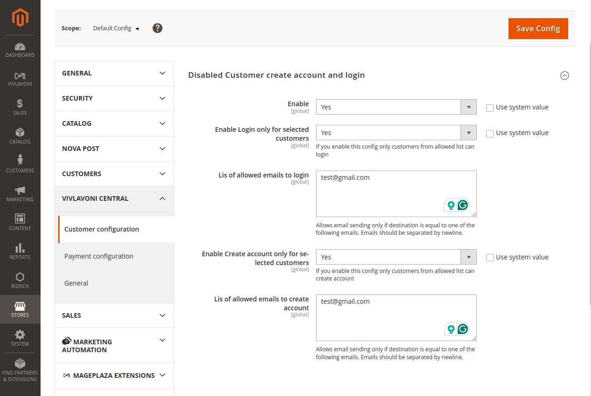

# Vivlavoni_DisablePaymentForCustomer

## Overview
Disable Login For Customer
The Disable Login For Customer module is developed by ViVlaVoNi, a Magento 2-focused company delivering lightweight, practical solutions for small eCommerce stores and resellers. We specialize in creating efficient modules that improve store operations without bloat or overhead.

Overview
Disable Login For Customer allows Magento 2 store owners to restrict login and account creation for general visitors. Only customers explicitly added to an internal whitelist can log in or register on the store.

This module helps you secure your storefront from unauthorized access while maintaining full access for approved clients.

Account & Pricing
No account or subscription is required. All features are available immediately upon installation. No hidden fees.

Features:
- Block Customer Login
Prevents all customers from logging in unless they're whitelisted by the admin.
- Disable Account Creation
Disables the “Create Account” functionality for the general public.
- Whitelist Customer Access
Add specific customers to a whitelist via the admin panel. Only whitelisted users can log in or create an account.
- Admin Management Interface
Manage the list of whitelisted customers easily through a dedicated admin grid or section.
- Seamless Integration
Works natively with Magento 2 without overriding core functionality.

Benefits:
- Secure Access Control
Limit who can access your storefront to prevent spam, fraud, or unauthorized users.
- Ideal for Private Stores
Useful for companies that only serve registered or vetted clients.
- No Code Customization Required
Easy setup and configuration from the admin panel — no development needed.
- Minimal Performance Impact
Designed to be lightweight and efficient.

Use Case Example:
You run a wholesale Magento 2 store that only sells to approved retailers. Instead of allowing open registration or login, you use this module to restrict access. You add your retail partners to the whitelist, and only they can sign in and place orders. All other users can't login/register because it disabled.

How It Works
- Install the module via Composer or manually.
- Access the admin configuration panel.
- Add customer accounts to the whitelist.
- Save settings and deploy changes.
- Only whitelisted users can now log in or register.

All other users are blocked from logging in or creating accounts — effectively turning your Magento store into a controlled-access platform.

## Installation via rar
- unpack the module into a folder `app/code`
- run command `bin/magento setup:upgrade`
- run command `bin/magento cache:flush`

## Uninstall via composer
- Remove folder `app/code/Vivlavoni/DisableLoginAndCreateAccount`
- run command `bin/magento setup:upgrade`
- run command `bin/magento cache:flush`

## Installation via composer
- Run `composer require vivlavoni/module-disable-login-and-create-account`

## Uninstall via composer
- Run `composer remove vivlavoni/module-disable-login-and-create-account`

## Module Images of functionality

- Config

  

## Compatibility
- Magento 2.4

## Dependencies
- Magento_Checkout

## Requirements
- PHP ^7.4 || ^8.1

## Author
ViVlaVoNi company

Volodymyr Blazhkov r2d2maloy98@gmail.com

* @copyright 2025 Volodymyr Blazhkov internet solutions GmbH
